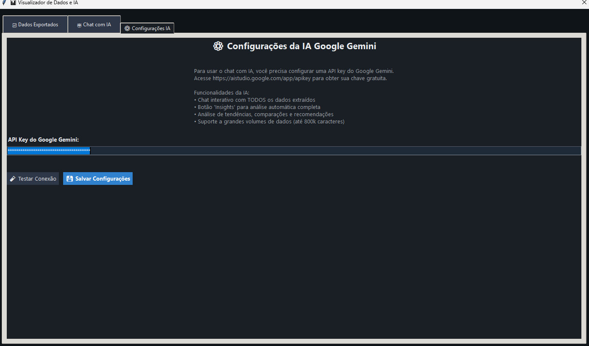
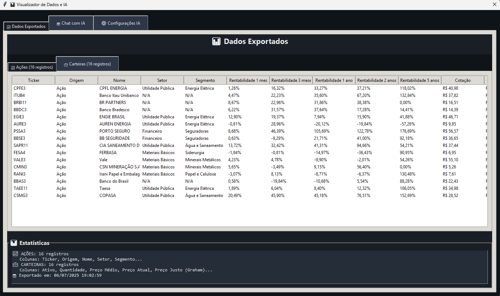
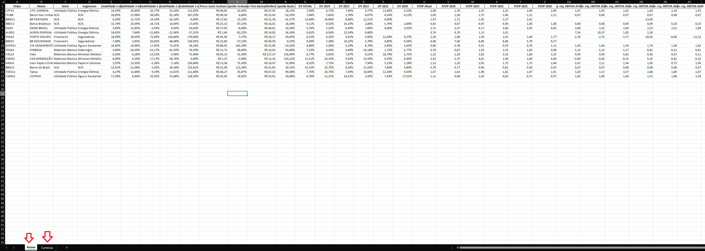

# Extrator de Dados - Investidor10

[](https://www.python.org/downloads/)
[](LICENSE)
[](https://selenium-python.readthedocs.io/)
[](https://github.com/andrelanzieri/scraping_investidor10/releases)
[](https://ai.google.dev/)

> 🚀 **Nova Funcionalidade:** **Chat com IA Google Gemini** - Análise inteligente e interativa dos dados extraídos! 🤖

> Uma ferramenta de automação de desktop de código aberto para extrair dados de ações do site Investidor10. Construída com Python, Selenium e Tkinter, esta aplicação oferece uma interface gráfica moderna, extração de dados personalizável, exportação para Excel e **análise inteligente com IA**.

**📥 Download do Executável:**
<https://github.com/andrelanzieri/scraping_investidor10/releases>

## 🤖 **DESTAQUE: Chat com IA Google Gemini**

### ✨ **Análise Inteligente dos Seus Dados**

Após a extração, uma nova tela é aberta automaticamente com funcionalidades avançadas de IA:

- **🧠 Chat Interativo**: Converse com a IA sobre seus dados extraídos
- **📊 Análise Automática**: Botão "Insights" para análise completa instantânea
- **🎯 Recomendações Personalizadas**: Sugestões de compra, venda e estratégias
- **📈 Análise Fundamentalista**: Avaliação de P/L, ROE, dividendos e muito mais
- **🔍 Identificação de Oportunidades**: Encontre as melhores ações baseado em dados reais
- **⚠️ Alertas de Risco**: Identifique problemas antes que se tornem prejuízos

### 🎯 **Como Funciona a IA**

1. **Extração Automática**: Seus dados são coletados normalmente
2. **Abertura Automática**: Nova tela com IA abre após a extração
3. **Contexto Completo**: A IA tem acesso a TODOS os seus dados
4. **Análise Inteligente**: Faça perguntas ou use o botão "Insights"
5. **Recomendações Práticas**: Receba sugestões baseadas em análise profissional

### 🔐 **Importante - Segurança da API Key**

⚠️ **ATENÇÃO**: Sua API key do Google Gemini é salva no arquivo `config.json`.

**🚨 NUNCA compartilhe este arquivo com outras pessoas ou publique no Git!**

- ✅ **Faça**: Adicione `config.json` ao `.gitignore`
- ❌ **Não faça**: Compartilhe ou publique o arquivo `config.json`
- 🔒 **Motivo**: Sua API key é pessoal e pode ser usada indevidamente por terceiros

## 🛠️ Tecnologias Utilizadas

- **Python:** Linguagem de programação principal.
- **Selenium:** Para automação de navegador web e extração de dados.
- **Tkinter:** Para a construção da interface gráfica.
- **Pandas:** Para manipulação e estruturação de dados.
- **OpenPyXL & XlsxWriter:** Para a criação de relatórios em Excel.
- **webdriver-manager:** Para o gerenciamento automático do ChromeDriver.
- **🤖 Google Gemini AI:** Para análise inteligente e chat interativo.

## 📋 Índice

- [✨ Características](#-características)
- [📸 Screenshots](#-screenshots)
- [🏗️ Versão 2.0 - Arquitetura Modular](#️-versão-20---arquitetura-modular)
- [📦 Instalação](#-instalação)
- [🚀 Uso](#-uso)
- [⚙️ Configuração](#️-configuração)
- [🔧 Características Técnicas](#-características-técnicas)
- [⚠️ Observações Importantes](#️-observações-importantes)
- [❓ FAQ - Perguntas Frequentes](#-faq---perguntas-frequentes)
- [🔧 Solução de Problemas](#-solução-de-problemas)
- [🤝 Contribuição](#-contribuição)
- [☕ Apoie o Projeto](#-apoie-o-projeto)
- [📄 Licença](#-licença)
- [🙏 Agradecimentos](#-agradecimentos)

## ✨ Características

- 🔄 **Extração Automatizada**: Coleta dados de ações individuais e carteiras recomendadas
- 🎨 **Interface Moderna**: GUI com temas claro/escuro e design responsivo
- ⚙️ **Configurações Flexíveis**: Colunas personalizadas e configurações persistentes
- 📊 **Exportação Excel**: Relatórios formatados com dados estruturados (xlsxwriter)
- 🤖 **Chat com IA**: Análise inteligente com Google Gemini após extração
- 🧠 **Insights Automáticos**: Análise completa com um clique
- 🎯 **Recomendações IA**: Sugestões personalizadas de investimento
- 🚫 **Sistema de Cancelamento**: Interrupção segura de extrações em andamento
- 🔧 **Arquitetura Modular**: Código organizado e de fácil manutenção
- 🛡️ **Extração Robusta**: Sistema de múltiplas tentativas e tratamento de erros
- 📦 **Executável Standalone**: Todas as dependências incluídas (~52MB)
- ⚡ **Performance Otimizada**: Extração de ~10-15 ações por minuto
- 🔒 **Seguro e Confiável**: Sem coleta de dados pessoais ou senhas

## 📸 Screenshots

### Interface Principal


*Interface principal da aplicação com tema escuro, mostrando a lista de ações configuradas e botões de ação.*

### 🤖 Chat com IA - Análise Inteligente


*Nova tela de chat com IA Google Gemini que abre automaticamente após a extração, permitindo análise interativa dos dados.*

### ⚙️ Configuração da API da IA



*Tela de configuração da API do Google Gemini para habilitar as funcionalidades de IA.*

### 📊 Visualização de Dados para Análise



*Visualização completa dos dados extraídos, organizados em abas para facilitar a análise da IA.*

### Resultado Excel



*Exemplo de arquivo Excel gerado com dados formatados e organizados.*

## 🏗️ Versão 2.0 - Arquitetura Modular

A aplicação foi completamente refatorada para uma arquitetura modular com separação clara de responsabilidades:

### 📁 Estrutura do Projeto

```
├── main.py                 # 🚀 Arquivo principal para inicialização
├── interface_app.py        # 🖥️ Classe InvestidorApp (Interface gráfica)
├── data_extractor.py       # 🔍 Classe DataExtractor (Extração de dados)
├── data_viewer.py          # 🤖 Classe DataViewer (Visualização e IA)
├── excel_exporter.py       # 📊 Classe ExcelExporter (Exportação Excel)
├── config.json            # ⚙️ Configurações persistentes
├── requirements.txt       # 📦 Dependências do projeto
├── run.bat               # 🪟 Script de inicialização (Windows)
├── build_executable.py   # 🔨 Script para gerar executável
├── build_executable.bat  # 🪟 Script auxiliar para build
└── README.md             # 📖 Documentação
```

### 🔧 Classes Principais

#### 🖥️ InvestidorApp (`interface_app.py`)

**Responsabilidades:**

- Gerenciamento da interface gráfica Tkinter
- Controle de temas (claro/escuro)
- Configurações de ações e colunas personalizadas
- Coordenação com o extrator de dados
- Sistema de atalhos de teclado (Ctrl+S, Ctrl+E, etc.)

#### 🔍 DataExtractor (`data_extractor.py`)

**Responsabilidades:**

- Configuração automática do WebDriver Chrome
- Extração de dados de ações individuais
- Extração de dados de carteiras recomendadas
- Processamento de seletores CSS complexos
- Tratamento de erros e tentativas múltiplas

#### 🤖 DataViewer (`data_viewer.py`)

**Responsabilidades:**

- Interface de visualização de dados extraídos
- Chat interativo com IA Google Gemini
- Análise automática com botão "Insights"
- Configuração e teste de API keys
- Processamento de respostas da IA com formatação markdown

#### 📊 ExcelExporter (`excel_exporter.py`)

**Responsabilidades:**

- Exportação de dados para Excel com formatação profissional
- Criação de planilhas separadas para ações e carteiras
- Aplicação de estilos e formatação condicional
- Geração de relatórios estruturados

## 📦 Instalação

### Pré-requisitos

- 🐍 **Python 3.8 ou superior** (recomendado Python 3.9+)
- 🌐 **Google Chrome** ou Chromium instalado
- 🔗 **Conexão estável com a internet**
- 💾 **~500MB de espaço livre** (para dependências e dados)

### Passos de Instalação

1. **Clone o repositório**:

   ```bash
   git clone https://github.com/andrelanzieri/scraping_investidor10.git
   cd scraping_investidor10
   ```

2. **Crie um ambiente virtual (recomendado)**:

   ```bash
   python -m venv .venv

   # Windows
   .venv\Scripts\activate

   # Linux/Mac
   source .venv/bin/activate
   ```

3. **Instale as dependências**:

   ```bash
   pip install -r requirements.txt
   ```

4. **Instale a dependência da IA (opcional)**:

   ```bash
   pip install google-generativeai
   ```

5. **Verifique a instalação**:

   ```bash
   python test_imports.py
   ```

   Este comando irá verificar se todas as dependências foram instaladas corretamente.

### 📋 Dependências

| Pacote | Versão | Descrição |
|--------|--------|-----------|
| `selenium` | 4.33.0 | Automação do navegador web |
| `pandas` | 2.2.3 | Manipulação e análise de dados |
| `openpyxl` | 3.1.5 | Leitura/escrita de arquivos Excel |
| `xlsxwriter` | ≥3.0.0 | Engine para escrita de Excel com formatação |
| `webdriver-manager` | 4.0.2 | Gerenciamento automático do ChromeDriver |
| `lxml` | ≥4.9.0 | Parser XML/HTML mais rápido para pandas (opcional) |
| `Pillow` | ≥10.0.0 | Processamento de imagens (capturas de tela) |
| `google-generativeai` | ≥0.3.0 | **🤖 IA Google Gemini** para análise inteligente |

## 🚀 Uso

### Inicialização

**Método 1 - Python**:

```bash
python main.py
```

**Método 2 - Script Windows (Recomendado)**:

```bash
run.bat
```

Este script inicia a aplicação diretamente, sem a necessidade de usar o terminal.

### 📝 Fluxo de Trabalho

1. **📈 Configuração de Ações**
   - Adicione os tickers das ações (ex: PETR4, VALE3, ITUB4)
   - Use o formato padrão da B3

2. **📊 Colunas Personalizadas**
   - Configure os dados específicos a extrair
   - Exemplos: P/L, ROE, Dividend Yield, etc.

3. **💾 Salvamento**
   - Use `Ctrl+S` ou clique em "Salvar Configurações"
   - Configurações são salvas em `config.json`

4. **🔍 Extração**
   - Use `Ctrl+E` ou clique em "Extrair Dados"
   - **Para extração de carteiras**: Desative a opção "Headless" para fazer login manual
   - Acompanhe o progresso na barra de status
   - Aguarde a conclusão do processo

5. **🤖 Análise com IA** (Nova Funcionalidade!)
   - Após a extração, uma nova tela abre automaticamente
   - Configure sua API key do Google Gemini (gratuita)
   - Use o chat interativo ou clique em "Insights" para análise completa
   - Receba recomendações personalizadas baseadas nos seus dados

### 📊 Tipos de Extração

#### 🏢 Dados de Ações Individuais

```
URL: https://investidor10.com.br/acoes/[TICKER]/
Dados: Indicadores fundamentalistas personalizáveis
Formato: Uma linha por ação no Excel
```

#### 🎯 Carteiras Recomendadas

```
URL: https://investidor10.com.br/carteiras/resumo/
Dados: Ticker, nome, preço, variação, setor
Formato: Tabela completa no Excel
```

## ⚙️ Configuração

### 📄 Arquivo config.json

Exemplo de configuração:

```json
{
  "acoes": ["PETR4", "VALE3", "ITUB4"],
  "colunas_personalizadas": [
    {
      "nome": "P/L",
      "seletor": ".indicator[data-name='pl'] .value"
    },
    {
      "nome": "ROE",
      "seletor": ".indicator[data-name='roe'] .value"
    }
  ],
  "tema": "claro"
}
```

### 🎨 Personalização de Interface

- **Temas**: Alterne entre claro e escuro
- **Atalhos**: `Ctrl+S` (Salvar), `Ctrl+E` (Extrair)
- **Configurações**: Persistem entre sessões

### 🤖 Configuração da IA

Para usar o chat com IA, você precisa:

1. **Obter API Key Gratuita**: Acesse [Google AI Studio](https://aistudio.google.com/app/apikey)
2. **Configurar na Aplicação**: Use a aba "Configurações IA" na tela de análise
3. **Testar Conexão**: Verifique se a API está funcionando
4. **Começar a Usar**: Chat interativo e análise automática disponíveis

#### 🔑 Como Obter API Key Gratuita

1. Acesse [aistudio.google.com/app/apikey](https://aistudio.google.com/app/apikey)
2. Faça login com sua conta Google
3. Clique em "Create API Key"
4. Copie a chave gerada
5. Cole na aplicação e salve

#### 🔐 Segurança da API Key

⚠️ **IMPORTANTE**: A API key é salva no arquivo `config.json` e **NÃO deve ser compartilhada**:

- 🚨 **Nunca** publique o arquivo `config.json` no Git
- 🔒 **Nunca** compartilhe sua API key com terceiros
- ✅ **Sempre** adicione `config.json` ao `.gitignore`
- 🛡️ **Mantenha** sua API key segura e privada

## 🔧 Características Técnicas

### 🏗️ Arquitetura Modular

| Característica | Benefício |
|---------------|-----------|
| **Separação de Responsabilidades** | Interface e extração independentes |
| **Baixo Acoplamento** | Fácil manutenção e extensão |
| **Alta Coesão** | Cada módulo tem propósito específico |

### 🚀 Recursos Avançados

- **🔒 Thread Safety**: Atualizações seguras da interface
- **⏹️ Sistema de Cancelamento**: Interrupção limpa de processos
- **💾 Configurações Persistentes**: Estado mantido entre execuções
- **🛡️ Tratamento de Erros**: Recuperação graceful de falhas
- **📊 Progress Tracking**: Acompanhamento em tempo real
- **🤖 IA Integrada**: Chat interativo com Google Gemini 2.5 Pro
- **🧠 Análise Automática**: Insights completos com um clique
- **📈 Recomendações Inteligentes**: Sugestões baseadas em análise profissional

### 🌐 WebDriver

- **🔄 Configuração Automática**: ChromeDriver baixado automaticamente via webdriver-manager
- **💾 Perfil Persistente**: Mantém login e configurações entre sessões
- **👻 Modo Headless**: Execução em background disponível (desative para login manual)
- **🛡️ Tratamento de Falhas**: Recuperação automática em caso de erros

## ⚠️ Observações Importantes

| ⚠️ Avisos | 📋 Descrição |
|----------|-------------|
| **Login Necessário** | Faça login no Investidor10 quando solicitado |
| **Dependência de Internet** | Requer conexão estável |
| **Conformidade Legal** | Respeite os termos de uso do site |
| **Backup Regular** | Faça backup do `config.json` |
| **🔐 Segurança API Key** | **NUNCA compartilhe ou publique o arquivo `config.json`** |

## ❓ FAQ - Perguntas Frequentes

### 🤔 Questões Gerais

**Q: O aplicativo é gratuito?**
A: Sim, completamente gratuito e open source.

**Q: Preciso de conta no Investidor10?**
A: Para dados básicos de ações, não. Para carteiras personalizadas, sim.

**Q: Quantas ações posso extrair por vez?**
A: Não há limite técnico, mas recomenda-se até 50 ações por extração.

**Q: Os dados são atualizados em tempo real?**
A: Os dados são do site Investidor10, atualizados conforme disponibilidade deles.

**Q: Posso usar em Linux/Mac?**
A: Sim, desde que tenha Python e Chrome instalados.

### 🤖 Questões sobre IA

**Q: A IA é gratuita?**
A: Sim! O Google Gemini oferece uma cota gratuita generosa para uso pessoal.

**Q: Preciso de conta no Google?**
A: Sim, para obter a API key gratuita do Google Gemini.

**Q: A IA tem acesso a todos os meus dados?**
A: A IA só tem acesso aos dados que você extraiu na sessão atual. Nenhum dado é enviado para outros serviços.

**Q: Posso usar sem a IA?**
A: Sim! A IA é opcional. A aplicação funciona normalmente sem ela.

**Q: Que tipo de análise a IA faz?**
A: Análise fundamentalista, recomendações de compra/venda, identificação de riscos, comparações entre ações e muito mais.

**Q: É seguro salvar a API key no arquivo config.json?**
A: A API key fica salva localmente no seu computador. NUNCA compartilhe ou publique o arquivo `config.json` no Git ou com terceiros. Adicione sempre `config.json` ao `.gitignore` se usar controle de versão.

### 🛠️ Questões Técnicas

**Q: Por que o Chrome abre durante a extração?**
A: É necessário para navegar no site. Use modo headless para execução em background.

**Q: Como adicionar novos indicadores?**
A: Configure na seção "Colunas Personalizadas" com seletores CSS apropriados.

**Q: O app funciona offline?**
A: Não, é necessária conexão com internet para acessar o site.

## 🔧 Solução de Problemas

### ❌ Problemas Comuns

| Problema | Solução |
|----------|---------|
| **Chrome não encontrado** | Instale o Google Chrome ou Chromium |
| **Erro de conexão** | Verifique sua conexão com a internet |
| **Dados não carregam** | Aguarde o login completo no site |
| **Selenium TimeoutException** | Aumente o tempo limite nas configurações |
| **Arquivo config.json corrompido** | Delete o arquivo para resetar configurações |
| **IA não funciona** | Verifique se a API key está configurada corretamente |
| **Erro "google-generativeai não instalada"** | Execute: `pip install google-generativeai` |
| **Tela de IA não abre** | Verifique se há dados extraídos para análise |

### 🐛 Debug e Logs

- **Verificar dependências**: Execute `python test_imports.py` para garantir que todas as bibliotecas necessárias estão instaladas.

- **Interface**: Mensagens de status na barra inferior
- **Pop-ups**: Erros detalhados em janelas de diálogo
- **Terminal**: Execute `python main.py` para logs completos
- **Arquivo de Log**: Considere implementar logging para arquivos

### 🆘 Comandos de Diagnóstico

```bash
# Verificar versão do Python
python --version

# Verificar dependências instaladas
pip list

# Testar importações essenciais
python -c "import selenium, pandas, openpyxl, xlsxwriter; print('✅ Todas as dependências OK')"

# Verificar versão do Chrome
# Windows
chrome --version
"C:\Program Files\Google\Chrome\Application\chrome.exe" --version

# Linux
google-chrome --version

# macOS
/Applications/Google\ Chrome.app/Contents/MacOS/Google\ Chrome --version

# Testar WebDriver
python -c "from selenium import webdriver; from webdriver_manager.chrome import ChromeDriverManager; print('✅ WebDriver OK')"
```

## 🤝 Contribuição

Contribuições são bem-vindas! Para contribuir:

1. 🍴 Faça um fork do projeto
2. 🌟 Crie uma branch para sua feature (`git checkout -b feature/AmazingFeature`)
3. 💾 Commit suas mudanças (`git commit -m 'Add some AmazingFeature'`)
4. 📤 Push para a branch (`git push origin feature/AmazingFeature`)
5. 🔄 Abra um Pull Request

### 💡 Ideias para Contribuição

- 📈 **Novos indicadores financeiros**: P/VP, EBIT, ROIC, etc.
- 🎨 **Melhorias na interface**: Novos temas, layouts responsivos
- 🔧 **Otimizações de performance**: Paralelização, cache inteligente
- 📊 **Novos formatos de exportação**: CSV, JSON, PDF
- 🧪 **Testes automatizados**: Unit tests, integration tests
- 🌐 **Suporte a outros sites**: Fundamentus, Status Invest
- 📱 **Interface mobile**: App móvel ou PWA
- 🔔 **Sistema de alertas**: Notificações por email/push
- 🤖 **Melhorias na IA**: Novos modelos, análises mais avançadas
- 📊 **Gráficos interativos**: Visualizações avançadas dos dados
- 🎯 **Alertas inteligentes**: Notificações baseadas em IA

## 📄 Licença

Este projeto está licenciado sob a **Licença MIT** - veja o arquivo [LICENSE](LICENSE) para detalhes.

**Resumo da Licença:**

- ✅ Uso comercial permitido
- ✅ Modificação permitida
- ✅ Distribuição permitida
- ✅ Uso privado permitido
- ❌ Nenhuma garantia fornecida
- ❌ Autor não é responsável por danos

## 🙏 Agradecimentos

- 🌐 [**Investidor10**](https://investidor10.com.br/) - Fonte dos dados fundamentalistas
- 🤖 [**Selenium**](https://selenium-python.readthedocs.io/) - Automação web robusta
- 📊 [**Pandas**](https://pandas.pydata.org/) - Manipulação e análise de dados
- 📈 [**XlsxWriter**](https://xlsxwriter.readthedocs.io/) - Geração de Excel formatado
- 🔧 [**WebDriver Manager**](https://github.com/SergeyPirogov/webdriver_manager) - Gerenciamento automático de drivers
- 🧠 [**Google Gemini**](https://ai.google.dev/) - IA avançada para análise inteligente
- 🐍 **Comunidade Python** - Suporte e bibliotecas excepcionais
- 💡 **Contribuidores** - Todos que reportaram bugs e sugeriram melhorias

**Tecnologias e Ferramentas:**

- 🖥️ **Tkinter** - Interface gráfica nativa
- 🎨 **ttkthemes** - Temas modernos para interface
- 🔄 **Threading** - Processamento assíncrono
- 📁 **JSON** - Armazenamento de configurações
