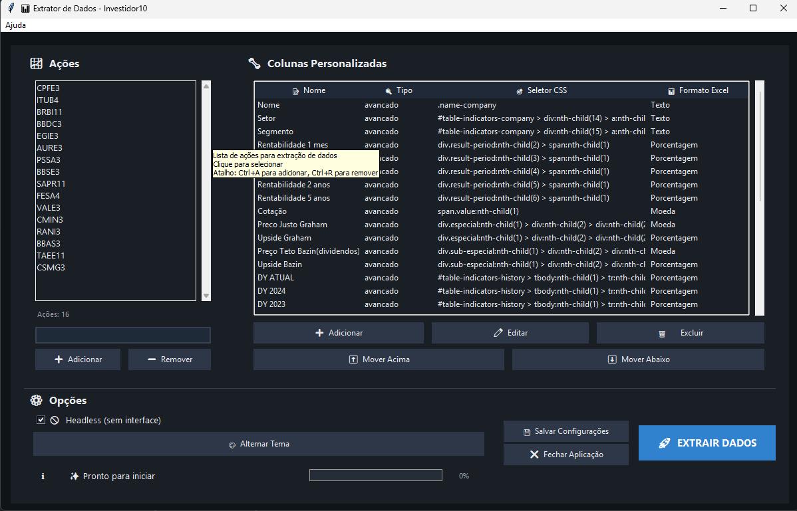
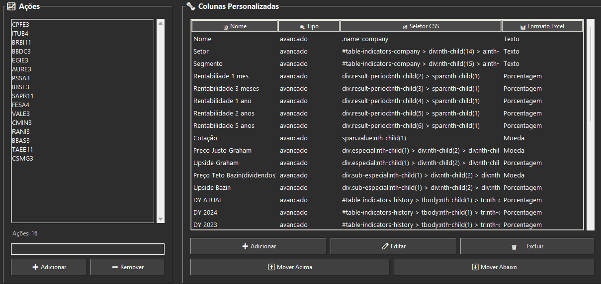

# Extrator de Dados - Investidor10

[](https://www.python.org/downloads/)
[](LICENSE)
[](https://selenium-python.readthedocs.io/)

> Ferramenta automatizada para extrair dados de ações do site Investidor10 com interface gráfica moderna e arquitetura modular.

Baixe executável em:
<https://github.com/andrelanzieri/scraping_investidor10/releases>

## 📋 Índice

- [Características](#-características)
- [Screenshots](#-screenshots)
- [Versão 2.0 - Arquitetura Modular](#-versão-20---arquitetura-modular)
- [Instalação](#-instalação)
- [Uso](#-uso)
- [Configuração](#-configuração)
- [Características Técnicas](#-características-técnicas)
- [Solução de Problemas](#-solução-de-problemas)
- [Contribuição](#-contribuição)

## ✨ Características

- 🔄 **Extração Automatizada**: Coleta dados de ações individuais e carteiras recomendadas
- 🎨 **Interface Moderna**: GUI com temas claro/escuro e design responsivo
- ⚙️ **Configurações Flexíveis**: Colunas personalizadas e configurações persistentes
- 📊 **Exportação Excel**: Relatórios formatados com dados estruturados (xlsxwriter)
- 🚫 **Sistema de Cancelamento**: Interrupção segura de extrações em andamento
- 🔧 **Arquitetura Modular**: Código organizado e de fácil manutenção
- 🛡️ **Extração Robusta**: Sistema de múltiplas tentativas e fallbacks
- 📦 **Executável Standalone**: Todas as dependências incluídas (~52MB)

## 📸 Screenshots

### Interface Principal



*Interface principal da aplicação com tema claro, mostrando a lista de ações configuradas e botões de ação.*

### Configuração de Ações



*Tela de configuração onde você pode adicionar/remover ações e personalizar colunas de dados.*

### Resultado Excel


*Exemplo de arquivo Excel gerado com dados formatados e organizados.*

## 🏗️ Versão 2.0 - Arquitetura Modular

A aplicação foi completamente refatorada para uma arquitetura modular com separação clara de responsabilidades:

### 📁 Estrutura do Projeto

```
├── main.py                 # 🚀 Arquivo principal para inicialização
├── interface_app.py        # 🖥️ Classe InvestidorApp (Interface gráfica)
├── data_extractor.py       # 🔍 Classe DataExtractor (Extração de dados)
├── config.json            # ⚙️ Configurações persistentes
├── requirements.txt       # 📦 Dependências do projeto
├── run.bat               # 🪟 Script de inicialização (Windows)
└── README.md             # 📖 Documentação
```

### 🔧 Classes Principais

#### InvestidorApp (`interface_app.py`)

```python
# Responsabilidades:
- Gerenciamento da interface gráfica Tkinter
- Controle de temas (claro/escuro)
- Configurações de ações e colunas personalizadas
- Coordenação com o extrator de dados
- Sistema de atalhos de teclado (Ctrl+S, Ctrl+E, etc.)
```

#### DataExtractor (`data_extractor.py`)

```python
# Responsabilidades:
- Configuração automática do WebDriver Chrome
- Extração de dados de ações individuais
- Extração de dados de carteiras recomendadas
- Processamento de seletores CSS complexos
- Exportação para Excel com formatação profissional
```

## 📦 Instalação

### Pré-requisitos

- 🐍 **Python 3.6 ou superior**
- 🌐 **Google Chrome** ou Chromium instalado
- 🔗 **Conexão estável com a internet**

### Passos de Instalação

1. **Clone o repositório**:

   ```bash
   git clone [URL_DO_REPOSITORIO]
   cd Scraping
   ```

2. **Instale as dependências**:

   ```bash
   pip install -r requirements.txt
   ```

3. **Verifique a instalação**:

   ```bash
   python main.py
   ```

### 📋 Dependências

| Pacote | Versão | Descrição |
|--------|--------|-----------|
| `selenium` | 4.33.0 | Automação do navegador web |
| `pandas` | 2.2.3 | Manipulação e análise de dados |
| `openpyxl` | 3.1.5 | Leitura/escrita de arquivos Excel |
| `xlsxwriter` | ≥3.0.0 | Engine para escrita de Excel com formatação |
| `webdriver-manager` | 4.0.2 | Gerenciamento automático do ChromeDriver |
| `requests` | ≥2.31.0 | Requisições HTTP (dependência adicional) |
| `lxml` | ≥4.9.0 | Parser XML/HTML mais rápido para pandas |
| `Pillow` | ≥10.0.0 | Processamento de imagens (capturas de tela) |

## 🚀 Uso

### Inicialização

**Método 1 - Python**:

```bash
python main.py
```

**Método 2 - Script Windows**:

```bash
run.bat
```

### 📝 Fluxo de Trabalho

1. **📈 Configuração de Ações**
   - Adicione os tickers das ações (ex: PETR4, VALE3, ITUB4)
   - Use o formato padrão da B3

2. **📊 Colunas Personalizadas**
   - Configure os dados específicos a extrair
   - Exemplos: P/L, ROE, Dividend Yield, etc.

3. **💾 Salvamento**
   - Use `Ctrl+S` ou clique em "Salvar Configurações"
   - Configurações são salvas em `config.json`

4. **🔍 Extração**
   - Use `Ctrl+E` ou clique em "Extrair Dados"
   - Desative a opção Headless para efetuar login e efetuar a extração de sua carteira
   - Acompanhe o progresso na barra de status

### 📊 Tipos de Extração

#### 🏢 Dados de Ações Individuais

```
URL: https://investidor10.com.br/acoes/[TICKER]/
Dados: Indicadores fundamentalistas personalizáveis
Formato: Uma linha por ação no Excel
```

#### 🎯 Carteiras Recomendadas

```
URL: https://investidor10.com.br/carteiras/resumo/
Dados: Ticker, nome, preço, variação, setor
Formato: Tabela completa no Excel
```

## ⚙️ Configuração

### 📄 Arquivo config.json

Exemplo de configuração:

```json
{
  "acoes": ["PETR4", "VALE3", "ITUB4"],
  "colunas_personalizadas": [
    {
      "nome": "P/L",
      "seletor": ".indicator[data-name='pl'] .value"
    },
    {
      "nome": "ROE",
      "seletor": ".indicator[data-name='roe'] .value"
    }
  ],
  "tema": "claro"
}
```

### 🎨 Personalização de Interface

- **Temas**: Alterne entre claro e escuro
- **Atalhos**: `Ctrl+S` (Salvar), `Ctrl+E` (Extrair)
- **Configurações**: Persistem entre sessões

## 🔧 Características Técnicas

### 🏗️ Arquitetura Modular

| Característica | Benefício |
|---------------|-----------|
| **Separação de Responsabilidades** | Interface e extração independentes |
| **Baixo Acoplamento** | Fácil manutenção e extensão |
| **Alta Coesão** | Cada módulo tem propósito específico |

### 🚀 Recursos Avançados

- **🔒 Thread Safety**: Atualizações seguras da interface
- **⏹️ Sistema de Cancelamento**: Interrupção limpa de processos
- **💾 Configurações Persistentes**: Estado mantido entre execuções
- **🛡️ Tratamento de Erros**: Recuperação graceful de falhas
- **📊 Progress Tracking**: Acompanhamento em tempo real

### 🌐 WebDriver

- **Configuração Automática**: ChromeDriver baixado automaticamente
- **Perfil Persistente**: Mantém login entre sessões
- **Headless Option**: Execução em background disponível

## ⚠️ Observações Importantes

| ⚠️ Avisos | 📋 Descrição |
|----------|-------------|
| **Login Necessário** | Faça login no Investidor10 quando solicitado |
| **Dependência de Internet** | Requer conexão estável |
| **Conformidade Legal** | Respeite os termos de uso do site |
| **Backup Regular** | Faça backup do `config.json` |

## 🔧 Solução de Problemas

### ❌ Problemas Comuns

| Problema | Solução |
|----------|---------|
| **Chrome não encontrado** | Instale o Google Chrome ou Chromium |
| **Erro de conexão** | Verifique sua conexão com a internet |
| **Dados não carregam** | Aguarde o login completo no site |
| **Selenium TimeoutException** | Aumente o tempo limite nas configurações |
| **Arquivo config.json corrompido** | Delete o arquivo para resetar configurações |

### 🐛 Debug e Logs

- **Interface**: Mensagens de status na barra inferior
- **Pop-ups**: Erros detalhados em janelas de diálogo
- **Terminal**: Execute `python main.py` para logs completos
- **Arquivo de Log**: Considere implementar logging para arquivos

### 🆘 Comandos de Diagnóstico

```bash
# Verificar versão do Python
python --version

# Verificar dependências instaladas
pip list

# Testar importações
python -c "import selenium, pandas, openpyxl; print('OK')"

# Verificar Chrome
google-chrome --version  # Linux
chrome --version         # Windows
```

## 🤝 Contribuição

Contribuições são bem-vindas! Para contribuir:

1. 🍴 Faça um fork do projeto
2. 🌟 Crie uma branch para sua feature (`git checkout -b feature/AmazingFeature`)
3. 💾 Commit suas mudanças (`git commit -m 'Add some AmazingFeature'`)
4. 📤 Push para a branch (`git push origin feature/AmazingFeature`)
5. 🔄 Abra um Pull Request

### 💡 Ideias para Contribuição

- 📈 Novos indicadores financeiros
- 🎨 Melhorias na interface
- 🔧 Otimizações de performance
- 📊 Novos formatos de exportação
- 🧪 Testes automatizados

## 📄 Licença

Este projeto está licenciado sob a Licença MIT - veja o arquivo [LICENSE](LICENSE) para detalhes.

## 🙏 Agradecimentos

- [Investidor10](https://investidor10.com.br/) - Fonte dos dados
- [Selenium](https://selenium-python.readthedocs.io/) - Automação web
- [Pandas](https://pandas.pydata.org/) - Manipulação de dados
- Comunidade Python - Suporte e bibliotecas

---

⭐ **Se este projeto foi útil, considere dar uma estrela!**
